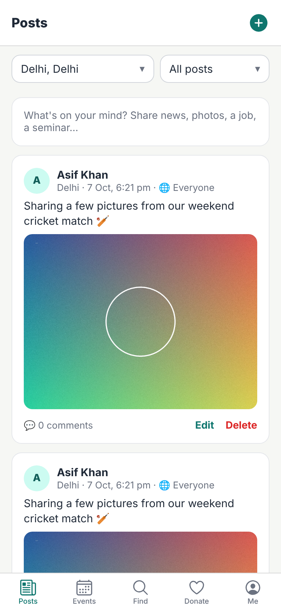
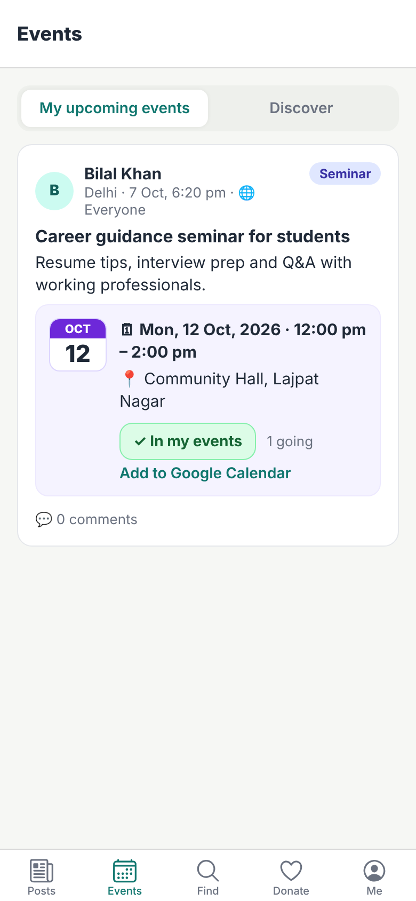
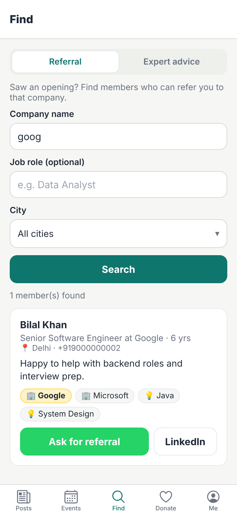
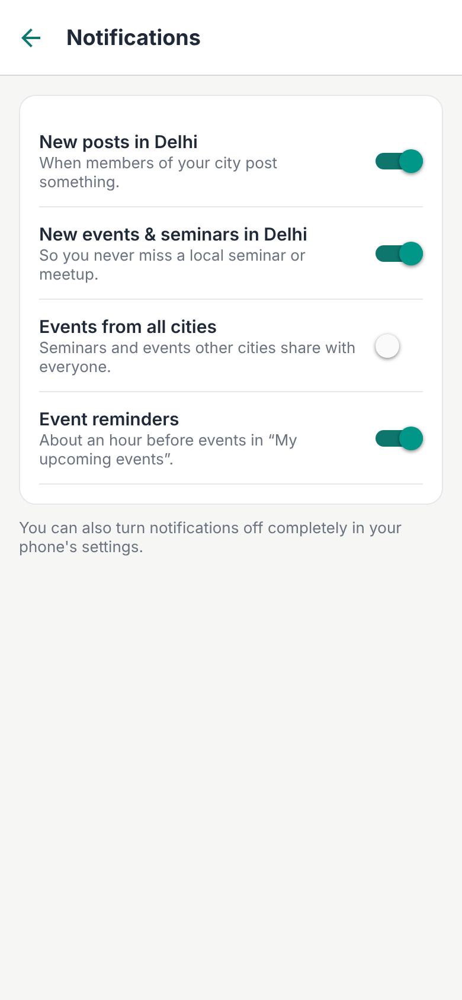

# Kamsar o Bar: mobile app (Android & iOS)

The Kamsar o Bar community app. It's a React Native app built with Expo.

**Backend and website:** [pycharm0422/kamsarobar](https://github.com/pycharm0422/kamsarobar). The app needs that backend running (locally or hosted) to work.

   

It's built on **Expo SDK 57** and talks to the same Spring Boot backend as the website.

| Area | What's in the app |
|---|---|
| **Posts** | City feed with filters, posting text and/or photos (big photos are shrunk to 3 MB or less on the phone, keeping their shape), who-can-see choice, comments, edit and delete. |
| **Events** | *My upcoming events* and *Discover*, an **Add to my events** button, and a Google Calendar link. |
| **Find** | Referral search by company and expert search by skill, each with a ready-made WhatsApp message. |
| **Donate** | Your city's fund by default (other cities on selection), bank and UPI details, a **Pay with a UPI app** button, and recording a contribution. |
| **Me** | Edit both profile forms, change password, notification settings, open the admin panel (admins), and log out. |
| **Push notifications** | New posts in your city, new events and seminars, and a reminder about an hour before events you added. Tapping a notification opens the post. |

The admin tools (members, blocking, city settings and verifying donations) stay on the website. The **Me** tab links there for admins.

## Why React Native (Expo)?

The website is already React and JavaScript, so the app reuses the same API calls, rules and WhatsApp/UPI logic, and one person can maintain both. Expo also gives free push notifications for Android and iOS, and builds the app in the cloud, so you don't need Android Studio or Xcode.

---

## 1. Set up

You need **Node.js 20.19+ or 22+**, and the [backend](https://github.com/pycharm0422/kamsarobar) running somewhere the phone can reach.

```bash
git clone https://github.com/pycharm0422/kamsarobar-mobile.git
cd kamsarobar-mobile
npm install
cp .env.example .env
```

Edit `.env`:
- `EXPO_PUBLIC_API_URL` is where your backend is, ending in `/api`:
  - Your live site: `https://your-domain/api`
  - A computer on your Wi-Fi: `http://192.168.1.5:8080/api`. Find the IP with `ipconfig` on Windows or `ipconfig getifaddr en0` on a Mac. Keep `ALLOW_HTTP=true` for this.
  - The Android emulator on the same computer: `http://10.0.2.2:8080/api`
- `EXPO_PUBLIC_WEB_URL` is your website address, used for the admin panel link.

**You can also change the server inside the app.** On the login screen, tap **Server: … Change**. Type your site's address (e.g. `https://kamsarobar.in`) or, for testing, your PC's Wi-Fi address and port (e.g. `192.168.1.5:8080`), then tap **Save & test**. The app checks that the server answers, then remembers it. This means one APK works with any backend.

## 2. See it quickly in a browser

```bash
npx expo start --web
```

This opens the app in your browser, which is handy for checking screens. Push notifications, the camera and the UPI app need a real phone.

## 3. Install it on your Android phone

Expo builds the app in the cloud and gives you an **APK** file to install. A free Expo account is enough; the free plan includes a limited number of builds each month.

```bash
npx eas-cli@latest login            # create a free account at expo.dev if you don't have one
npx eas-cli@latest init             # links the project; copy the project id it prints into .env as EAS_PROJECT_ID
npx eas-cli@latest build -p android --profile preview
```

When the build finishes, open the link it prints on your phone, download the APK and install it. Android will ask you to allow installing from that source.

- **The `preview` build** is a normal installable app. If it should talk to a plain `http://` test server, set `ALLOW_HTTP=true` in the build's environment. A real deployment should use `https`.
- **The `development` build** (`--profile development`) is for programmers. It loads your code live from `npx expo start`, so changes show up instantly.

> **Expo Go won't do push notifications.** Expo Go is the ready-made app from the Play Store. Since SDK 53 it can't receive push notifications on Android, so use one of the builds above.

### Or build the APK on your own computer (no Expo account)

This needs the Android SDK (easiest: install Android Studio) and Java 17.

```bash
ALLOW_HTTP=true npx expo prebuild -p android     # generates the android/ folder from app.config.js
cd android
./gradlew assembleRelease                         # takes ~10 minutes the first time
```

The APK is saved to `android/app/build/outputs/apk/release/app-release.apk`.
- It's signed with a test key, which is fine for installing directly on phones but not for the Play Store.
- To build only for 64-bit phones (faster and smaller), add `-PreactNativeArchitectures=arm64-v8a`.

## 4. Turn on push notifications

Android notifications are delivered by Google's Firebase. Expo sends them for you, but it needs your Firebase details once:

1. Go to <https://console.firebase.google.com> and create a project. It's free.
2. **Add an Android app** with the package name **`com.kamsarobar.app`**. Download **`google-services.json`** and put it in the project folder. Keep `GOOGLE_SERVICES_JSON=./google-services.json` in `.env`.
3. In Firebase, go to **Project settings → Service accounts → Generate new private key**. This downloads a JSON key file.
4. Run `npx eas-cli@latest credentials`, then choose **Android → your build profile → Google Service Account → FCM V1** and upload that JSON key.
5. Build again (step 3). When you log in, the app asks permission to send notifications. After that, new posts and events arrive as notifications.

Expo's own guide has screenshots of these steps: <https://docs.expo.dev/push-notifications/fcm-credentials/>

**On the server:** the [backend](https://github.com/pycharm0422/kamsarobar) sends notifications through Expo's push service, so it needs outgoing internet access to `exp.host`. Set `PUSH_PROVIDER=log` if you only want them written to the log, for example on a computer with no internet. The backend's notification API is described in its [docs/API.md](https://github.com/pycharm0422/kamsarobar/blob/main/docs/API.md#push-notifications-mobile-app).

**Who gets what:**

| Notification | Who receives it |
|---|---|
| New post | Members living in that city. Members can turn this off. |
| New event or seminar | Members of that city. If the event is shared with everyone, members of other cities who turned on *Events from all cities* also get it. |
| Starting soon | About an hour before an event you added to *My upcoming events*. |

The author is never notified about their own post, and blocked members get nothing. Each member chooses what they get under **Me → Notification settings**.

## 5. iPhone

The same code runs on iPhone. To install it on iPhones or publish it to the App Store, you need an **Apple Developer account** (USD 99 a year). Then run `npx eas-cli@latest build -p ios`. EAS sets up Apple's push notification keys during that build.

## 6. Publish to the Play Store (optional)

```bash
npx eas-cli@latest build -p android --profile production   # makes an .aab for the Play Store
npx eas-cli@latest submit -p android
```

A Google Play developer account costs a one-time USD 25.

## Code layout

```
kamsarobar-mobile/
├── app.config.js          app name, icons, permissions, plugins (reads .env)
├── eas.json               cloud build profiles: development / preview (APK) / production
└── src/
    ├── app/               screens (Expo Router: each file is a screen)
    │   ├── _layout.js     login gate, and opening a post when a notification is tapped
    │   ├── (tabs)/        Posts · Events · Find · Donate · Me
    │   ├── post/          post details + comments, write/edit a post
    │   ├── profile/       edit profile (both forms + password)
    │   ├── login.js, register.js, notifications.js
    ├── api/               HTTP client + one small API object per resource
    ├── auth/              login state; token kept in the phone's secure storage
    ├── notifications/     permission, push token, opening the right post on tap
    ├── components/        post card, photos, event box, pickers, WhatsApp composer...
    └── utils/             photo resizing, WhatsApp/UPI/calendar links, formatting
```

**Checking that the code builds:** `npm run check` bundles the app for Android and for web. It should finish without errors.
